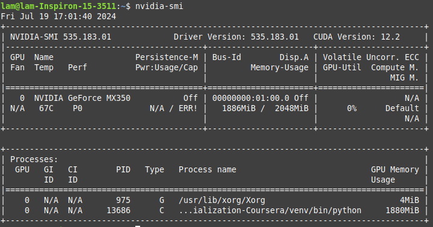

# Machine Learning Specialization Coursera


## Introduction

Contains Solutions and Notes for the [Machine Learning Specialization](https://www.coursera.org/specializations/machine-learning-introduction/?utm_medium=coursera&utm_source=home-page&utm_campaign=mlslaunch2022IN) by Andrew Ng on Coursera.

This repo is folked from [here](https://github.com/greyhatguy007/Machine-Learning-Specialization-Coursera)
with the following modifications:

1. Rewrite README.md, adding Local Environment Setup guide
2. Add `requirements.txt` (#) and `.gitignore`.

## Why Yet Another Folk?

Because:

(#) Ironically this should have been of top priority
since people cloning this repo will want to run their
notebooks locally. Unfortunately, I have had a hard
time figuring out the exact versions of the
packages/dependencies that the notebooks require.
**If wrong versions are installed, some notebooks**
**will yield errors that should not have been there!**

And I don't want you to also suffer from this
version mess.

Just install with that `requirements.txt`
and you will be good to go (see below).

- [Machine Learning Specialization Coursera](#machine-learning-specialization-coursera)
  - [Introduction](#introduction)
  - [Why Yet Another Folk?](#why-yet-another-folk)
  - [Local Environment Setup](#local-environment-setup)
    - [Install NVIDIA CUDA libraries](#install-nvidia-cuda-libraries)
    - [Install Python](#install-python)
    - [Setup your Virtual Environment](#setup-your-virtual-environment)
    - [Check if Tensorflow can access GPU](#check-if-tensorflow-can-access-gpu)
    - [Ready](#ready)
    - [Known Issues](#known-issues)

## Local Environment Setup

The following guide applies to Linux. Windows users
should be able to achieve the same goals, just in
a different way.

### Install NVIDIA CUDA libraries

See this guide: <https://twm.me/posts/how-to-use-tensorflow-with-gpu-linux/>

### Install Python

You **MUST** have Python 3.7 installed. Otherwise,
when you get to the part of installing packages,
conflicts will occur and you won't be able to resolve
them!

1. Install Python 3.7.17. See [this guide](https://tecadmin.net/how-to-install-python-3-12-on-ubuntu-debian-linuxmint/)
    (just substitute Python 3.12 with Python 3.7.17)

2. Verify your Python 3.7 installation.

    ```sh
    python3.7 -V
    pip3.7 -V
    ```

### Setup your Virtual Environment

First, `cd` into this project's directory. Then:

```sh
virtualenv venv -p $(which python3.7)
source ./venv/bin/activate
pip install -r requirements.txt
```

Then, open the notebook files with VSCode.
You may need to install relevant extensions
like Jupyter Notebook for VSCode first.

### Check if Tensorflow can access GPU

Because if not, it will default to your CPU
and will not utilize your GPU at all!

There are a few ways to check this.

1. Run the following code (of course within
    the virtual environment you just set up):

    ```python
    import tensorflow as tf

    gpu_devices = tf.config.experimental.list_physical_devices('GPU')
    print("Num GPUs Available: ", len(gpu_devices))
    ```

    This should output 1, 2 or more.

2. Open notebook [CoffeeRoasting TF - an Optional Lab in Advanced Algorithms course](./C2%20-%20Advanced%20Learning%20Algorithms/week1/optional-labs/C2_W1_Lab02_CoffeeRoasting_TF.ipynb).
     Then run all the code snippets from the beginning
     to the point where you see output like `Epoch 1/10`, `Epoch 2/10`...
     The code will take some time to complete - meanwhile, in
     your terminal, quickly type `nvidia-smi` and you should see
     that Tensorflow is indeed using your GPU.

     As an example, below is my output. Notice the last line!

     

### Ready

From now on, you don't have to repeat the
previous steps anymore. Just open the notebooks
and you should be able to practice right away!

### Known Issues

Only if you encounter these issues will you need
to fix them!

- [Jupyter Kernel crashes when using Tensorflow](https://github.com/microsoft/vscode-jupyter/wiki/Kernel-crashes-when-using-tensorflow)
- [Why you MAY need to install `tensorrt`](https://stackoverflow.com/a/75745465/13680015)
- The annoying warning `Successful NUMA node read from SysFS had negative value (-1), but there must be at least one NUMA node, so returning NUMA node zero`:
  - [Quick fix](https://github.com/tensorflow/tensorflow/issues/42738#issuecomment-922422874)
  - [Reason why](https://gist.github.com/zrruziev/b93e1292bf2ee39284f834ec7397ee9f)
